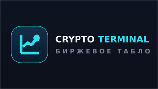

# Crypto TV Terminal — Android TV (APK)

Полноэкранное Android TV приложение — визуальное табло крипторынка для постоянной
работы на телевизоре и считывания с расстояния 2–4 м. Внешний слой (вёрстка, цвета,
анимации) собран в дизайне; этот проект превращает его в нативное, постоянно
работающее TV-приложение **с реальными данными** (цены, изменения, спарклайны,
индекс страха и жадности, доминация BTC, капитализация, фандинг, газ Ethereum,
крупные биржевые сделки и новости из десятков источников) и собирает устанавливаемый APK.



---

## ⚠️ Как получить сам APK (важно прочитать)

Готовый `.apk` **не приложен бинарём**, потому что среда, где собирался проект, не
имеет ни Android SDK, ни доступа в интернет, чтобы его докачать — скомпилировать APK
там физически невозможно. Поэтому здесь — **полностью готовый к сборке проект** и три
способа получить из него APK. Самый простой — первый, он не требует ничего ставить
на компьютер.

### Способ A — GitHub Actions (рекомендуется, без установки инструментов)
1. Создайте репозиторий на GitHub и загрузите туда содержимое этой папки
   (либо `git init && git add . && git commit && git push`).
2. Откройте вкладку **Actions** → workflow **«Build APK»** уже лежит в проекте.
   Он запустится сам на `push`, либо нажмите **Run workflow**.
3. Через ~3–5 минут в завершённом запуске, внизу в разделе **Artifacts**, появится
   архив **`crypto-tv-terminal-debug`** — внутри `app-debug.apk`. Скачайте его.

Это полноценный устанавливаемый APK (подписан debug-ключом, ставится на любое TV).

### Способ B — Android Studio (если он установлен)
1. **File → Open** → выберите эту папку. Дайте студии синхронизироваться (она сама
   скачает Gradle, Android SDK-компоненты и зависимости, а также до-создаст
   `gradle-wrapper.jar`).
2. **Build → Build Bundle(s) / APK(s) → Build APK(s)**.
3. APK появится в `app/build/outputs/apk/debug/app-debug.apk`.

### Способ C — командная строка (Linux/macOS/Windows с интернетом)
Нужны JDK 17 и Android SDK (cmdline-tools). Затем из папки проекта:

```bash
# один раз материализуем gradle wrapper (если есть установленный gradle):
gradle wrapper --gradle-version 8.9
# затем сборка:
./gradlew assembleDebug
# APK: app/build/outputs/apk/debug/app-debug.apk
```
Если установленного `gradle` нет — поставьте его (`sdkman`, `brew install gradle`,
или скачайте с gradle.org), либо используйте Способ A/B.

> Примечание про wrapper: бинарный `gradle/wrapper/gradle-wrapper.jar` намеренно не
> включён (его нельзя было скачать в офлайн-среде). Android Studio и команда
> `gradle wrapper` создают его автоматически; GitHub Actions использует Gradle напрямую
> и в нём не нуждается. Версия Gradle закреплена в `gradle/wrapper/gradle-wrapper.properties`.

---

## 📺 Установка на телевизор

**Через ADB по сети (Android TV / Google TV):**
```bash
# на ТВ: Настройки → Об устройстве → 7 раз по «Сборка» (вкл. режим разработчика),
#        затем Настройки → Система → Для разработчиков → Отладка по USB / по сети.
adb connect <IP_телевизора>:5555
adb install -r app-debug.apk
```
Приложение появится на главном экране Android TV (иконка + баннер «CRYPTO TERMINAL»).

**Через USB-флешку / файловый менеджер:** скопируйте `app-debug.apk` на флешку,
вставьте в ТВ, откройте любым файловым менеджером (напр. X-plore / Send files to TV)
и установите (разрешите установку из неизвестных источников).

**Fire TV:** `adb connect <IP>:5555` → `adb install -r app-debug.apk` (так же).

---

## Что было доделано (от дизайна к приложению)

Дизайн-пакет был **HTML/CSS/JS прототипом** (референс вида и поведения). Превращён в
рабочее TV-приложение:

- **Нативная Android-обёртка** (`MainActivity.kt`) — один полноэкранный `WebView`,
  который грузит локально упакованное табло из `assets/`. Реализовано:
  экран не гаснет (`KEEP_SCREEN_ON`), иммерсивный полноэкранный режим, фиксация
  landscape, защита от случайного закрытия с пульта (BACK), корректный lifecycle,
  и доступ страницы из `assets` к сетевым API (для реальных данных).
- **Исправлено масштабирование** — раньше WebView дополнительно зумил страницу
  (`useWideViewPort`/`overviewMode`) и конфликтовал с масштабированием макета, из-за
  чего верстка не вписывалась в экран. Теперь зум WebView отключён, а сцена 1920×1080
  точно вписывается в любой экран/плотность через `transform: translate()+scale()`
  с пиксельным центрированием (`terminal.js → fitStage`, `terminal.css → #stage`).
- **Реальные данные** (`config.js` + `api.js`) — слой опроса публичных API: цены/
  изменения/спарклайны и капитализация/доминация (CoinGecko), индекс страха и жадности
  (alternative.me), фандинг (OKX→Bybit), газ Ethereum (публичный RPC), крупные сделки
  (биржевой поток OKX выше порога), новости (RSS десятков источников через CORS-прокси
  или CryptoPanic по ключу). Данные приводятся к DTO из ТЗ §7, кэшируется последнее
  валидное значение, при сбое числа **не выдумываются** (показывается «—»/последнее).
  UI (`terminal.js`) только подписывается на события и перерисовывает.
- **TV-ресурсы** — иконка лаунчера (все плотности) и баннер 320×180 для
  Leanback-лаунчера; манифест с `LEANBACK_LAUNCHER`, баннером, landscape и
  обработкой `configChanges` (смена времени/таймзоны/UI-режима не перезапускает табло).
- **Сборка** — Gradle-проект (AGP 8.5.2 / Kotlin 1.9.24 / Gradle 8.9) + готовый
  GitHub Actions workflow, выдающий APK артефактом.

### Соответствие acceptance-критериям (ТЗ §19)
| Критерий | Где реализовано |
|---|---|
| §19.1 Локальное системное время, реакция на смену без перезапуска | веб `new Date()` каждую секунду + `configChanges` в манифесте (WebView не пересоздаётся) |
| §19.2 Watchlist: фикс.+ротация, pulse цены на реальных изменениях | `terminal.js` (`renderWatchlist`/`rotateWatchlist`/`updateVisibleRows`, rotation 45 с) ← FEED `markets` |
| §19.3 BTC/ETH независимо, троттлинг мигания | `refreshHeroes()` (throttle 1 с) ← FEED `markets` |
| §19.4 Новости без полной перезагрузки, подсветка, без дублей | `onNews()` / `is-new` glow / dedup по id ← FEED `news:item` (RSS/CryptoPanic) |
| §19.5 Лента сделок: вход слева, сдвиг, выход справа, очередь | `onWhale()` + `txEnter` ← FEED `whale` (биржевой поток OKX) |
| §19.6 Stability, длительная работа | таймауты+фолбэки на запросах, кэш последнего значения, `KEEP_SCREEN_ON`, без полной перерисовки |

---

## Источники данных (реальные) и настройка

Всё табло наполняется реальными данными. Провайдеры, интервалы опроса, ключи и
**большой список источников новостей** вынесены в `app/src/main/assets/web/config.js`
— меняются без правки логики. Слой опроса — `api.js`, отрисовка — `terminal.js`.

| Блок | Провайдер | Ключ | Примечание |
|---|---|---|---|
| Цены, 24ч/7д, объём, спарклайны | CoinGecko `/coins/markets` | не нужен | публичный лимит ~5–30 запросов/мин на общий IP |
| Капитализация, доминация BTC | CoinGecko `/global` | не нужен | |
| Индекс страха и жадности | alternative.me `/fng` | не нужен | обновляется раз в сутки |
| Фандинг (BTC/ETH/SOL/XRP) | OKX → запасной Bybit | не нужен | |
| Газ Ethereum (Gwei + $) | публичный RPC (llama/ankr/cloudflare) | не нужен | `eth_feeHistory`/`eth_gasPrice` |
| Крупные сделки | биржевой поток OKX (сделки выше порога) | не нужен | это крупные **биржевые** сделки, не он-чейн киты |
| Новости | RSS десятков источников через CORS-прокси, либо CryptoPanic | по желанию | см. ниже |
| Ликвидации 24ч | — | CoinGlass (платный) | **без ключа показывает «н/д»** — бесплатных данных нет, числа не выдумываются |

**Рекомендуется (бесплатно, повышает стабильность) — впишите в `config.js → keys`:**
- `coingeckoDemo` — бесплатный Demo-ключ CoinGecko (coingecko.com/api → Demo), даёт
  стабильные ~30 запросов/мин и убирает редкие пропуски цен на общем IP.
- `cryptopanic` — бесплатный токен cryptopanic.com/developers/api: новости станут
  надёжнее и единым потоком (RSS-прокси иногда «капризничают»).

**Интервалы опроса** — `config.js → intervals` (мс). По умолчанию: цены 45 с, глобал
60 с, газ 30 с, фандинг 60 с, новости 90 с, крупные сделки 8 с. Хотите «живее» цены —
уменьшите `markets` (с Demo-ключом CoinGecko это безопасно).

**Новости** — `config.js → newsSources`: ~30 источников (EN + RU: CoinDesk,
Cointelegraph, The Block, Decrypt, ForkLog, Bits.media, Incrypted и др.). Добавляйте/
убирайте строками. Опрашиваются по ротации, дубликаты по ссылке отсекаются.

### Важные оговорки по реальным данным
- **Гео-ограничения.** Некоторые API (OKX и т.п.) могут быть недоступны из отдельных
  стран/сетей. Если фандинг/крупные сделки не появляются — дело в доступности
  провайдера из сети телевизора (для фандинга есть запасной Bybit; для остального
  можно дописать запасные биржи в `config.js`).
- **Лимиты CoinGecko.** На общем IP без ключа возможны редкие пропуски обновления
  (тогда показывается последнее валидное значение) — лечится бесплатным Demo-ключом.
- **Ликвидации** требуют платного провайдера (CoinGlass). Без ключа блок честно
  показывает «н/д», а не выдуманные суммы.
- **Сеть в WebView.** Страница из `assets` (file://) ходит в сеть благодаря
  `allowUniversalAccessFromFileURLs` (включено в `MainActivity.kt`). Это безопасно,
  т.к. WebView грузит только нашу собственную страницу. На очень старых WebView, если
  данные не грузятся, это первый рычаг для проверки.

## Шрифт
Дизайн использует **Manrope**. В офлайн-сборке стоит системный фолбэк (Roboto на
Android TV) — выглядит чисто. Чтобы получить точный Manrope: положите
`Manrope-Variable.woff2` в `app/src/main/assets/web/fonts/` и раскомментируйте блок
`@font-face` в `terminal.css` (подробности — в `assets/web/fonts/README.txt`).

## Подпись релиза (для публикации, не для теста)
Debug-APK уже подписан debug-ключом и ставится на ТВ. Для релиза создайте keystore
(`keytool -genkey -v -keystore release.jks -alias key -keyalg RSA -keysize 2048 -validity 10000`),
добавьте `signingConfigs { release { ... } }` в `app/build.gradle`, привяжите к
`buildTypes.release` и соберите `assembleRelease`.

---

## Структура проекта
```
CryptoTVTerminal/
├─ app/
│  ├─ build.gradle                      конфиг модуля (compile/min/target SDK, Kotlin)
│  ├─ proguard-rules.pro
│  └─ src/main/
│     ├─ AndroidManifest.xml            leanback-лаунчер, баннер, landscape, configChanges
│     ├─ java/com/cryptotv/terminal/
│     │  └─ MainActivity.kt             полноэкранный kiosk-WebView хост
│     ├─ res/
│     │  ├─ values/                     strings, colors, fullscreen-тема
│     │  ├─ drawable-xhdpi/banner.png   TV-баннер 320×180
│     │  └─ mipmap-*/ic_launcher.png    иконки всех плотностей
│     └─ assets/web/                    ← табло (тот самый дизайн) + реальные данные
│        ├─ index.html
│        ├─ terminal.css                токены/стили; #stage — точное вписывание в экран
│        ├─ config.js                   ПРОВАЙДЕРЫ, интервалы, ключи, список новостей
│        ├─ api.js                      слой опроса публичных API → шина событий FEED
│        ├─ data.js                     метаданные монет + начальное состояние
│        ├─ terminal.js                 рендер: часы, ротация, hero, новости, лента, шапка
│        └─ fonts/                      сюда можно положить Manrope (опционально)
├─ build.gradle · settings.gradle · gradle.properties
├─ gradle/wrapper/gradle-wrapper.properties   (gradle 8.9; jar до-создаётся студией/CI)
└─ .github/workflows/build-apk.yml      сборка APK в облаке → артефакт app-debug.apk
```

> Поток данных: `config.js` (что и откуда) → `api.js` (опрос с таймаутами/фолбэками,
> приведение к DTO, кэш, события `FEED`) → `terminal.js` (подписка + перерисовка).
> Чтобы добавить источник или поменять интервал — правится только `config.js`.

## Закреплённые версии
- Android Gradle Plugin **8.5.2**, Kotlin **1.9.24**, Gradle **8.9**
- `compileSdk` / `targetSdk` **34**, `minSdk` **21** (покрывает практически все Android TV / Fire TV)
- JDK **17** для сборки

## Альтернатива на будущее
Если позже потребуется чисто нативный UI (без WebView) ради максимальной
производительности на очень слабых ТВ — экран реалистично переписать на
**Jetpack Compose for TV** по тем же DTO и токенам из ТЗ. Для текущей задачи
WebView-обёртка воспроизводит утверждённый дизайн 1:1 и сохраняет все анимации.
